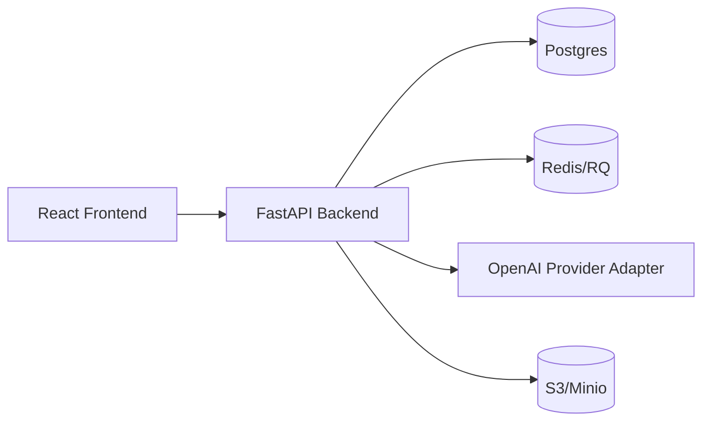

# Architecture

```mermaid
flowchart LR
UI[React Frontend] --> API[FastAPI Backend]
API --> PG[(Postgres)]
API --> REDIS[(Redis/RQ)]
API --> LLM[OpenAI Provider Adapter]
API --> MINIO[(S3/Minio)]
```

## Flows
- Import SMS -> parse -> categorize -> confirm -> save.
- Chat “Can I buy X?” -> context builder -> safety-wrapped LLM template -> disclaimer response.
